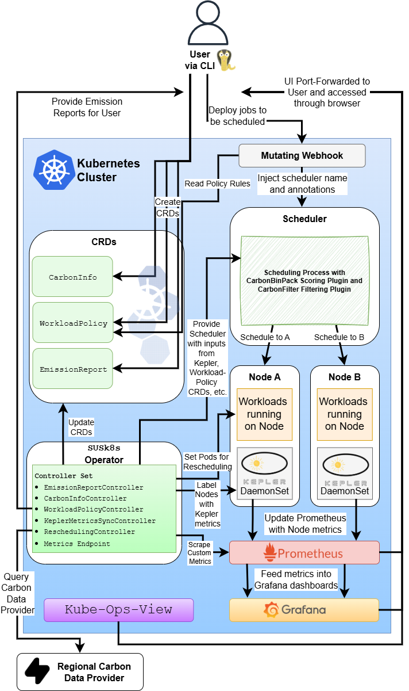

# George Lipceanu FYP 
## SusK8s: Sustainable Kubernetes Extension Stack

> Elevating energy and carbon emissions to first-class operational signals in Kubernetes.

---

## About the Project

Kubernetes natively lacks mechanisms to manage the carbon impact of growing cloud workloads. SUSk8s addresses this by turning energy into a configurable signal which can be installed in Kubernetes clusters. It uses Custom Resource Definitions for declarative policy
enforcement and a custom operator to manage these, with Kepler, Prometheus and Grafana
providing supporting telemetry. A custom scheduler runs alongside the default, prioritising
low-carbon nodes via a custom scoring plugin, with the custom operator running a rescheduler
controller continuously evicts non-compliant pods.

---

## Key Features

* **Proactive Carbon-Aware Scheduling:** Uses a custom `susk8s-scheduler` plugins to score and filter nodes based on real-time grid carbon intensity.
* **Carbon-Aware Operator:** Uses the `susk8s-operator` as a central management engine in charge of:
  * **Dynamic Workload Rescheduling:** Safely and autonomously evicts workloads from dirty nodes to greener regions using the native Kubernetes Eviction API.
  * **Mutating Admission Webhook:** Automatically intercepts and injects sustainability boundaries into pods before they hit the cluster.
  * **Carbon Intensity Info:** Ingests live grid intensity data from ElectricityMaps API.
  * **Generating Auditable Reports:** Creates sustainability summaries and savings data based on fields given in `EmissionReport` CRD resource.
* **Hardware-Level Telemetry:** Integrates with Kepler (eBPF) to provide real-time, process-level power estimation.
* **Automated CLI:** A custom Cobra-based CLI `susk8s` for Day-1 cluster provisioning and Day-2 observability routing.

---

## System Architecture

## Links to Project Resources
* [Project Report](https://github.com/georgelipceanu/fyp/blob/main/fyp2-document)
* [Video Demo](https://youtu.be/iW1LNHVbpUc)
* [Source Code](https://github.com/georgelipceanu/susk8s)
* [Supervisor Meetings (Sem 1)](supervisor-meetings.md)
* [Supervisor Meetings (Sem 1)](supervisor-meetings-sem2.md)

---
